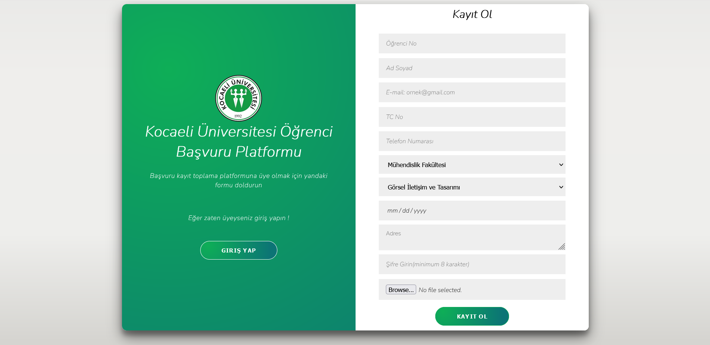
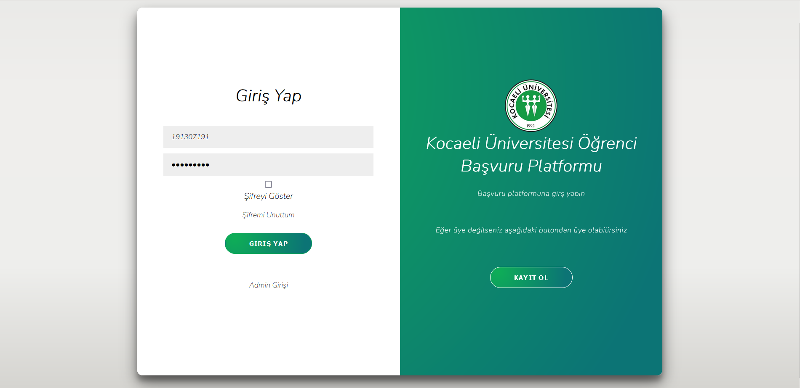
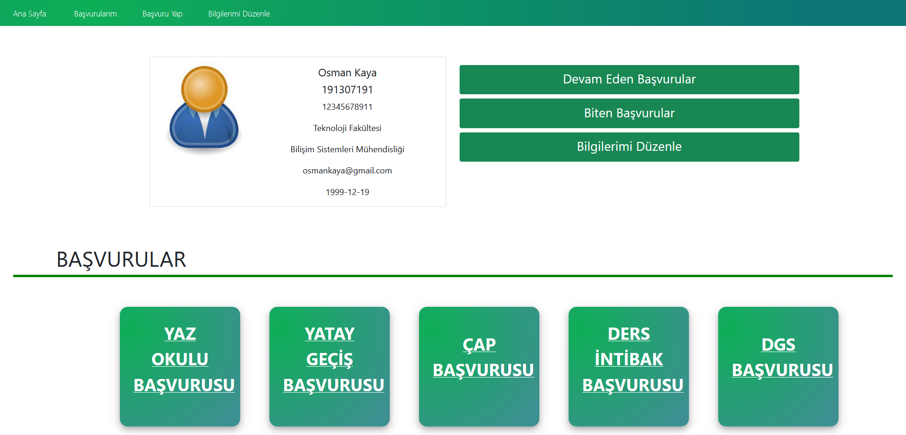
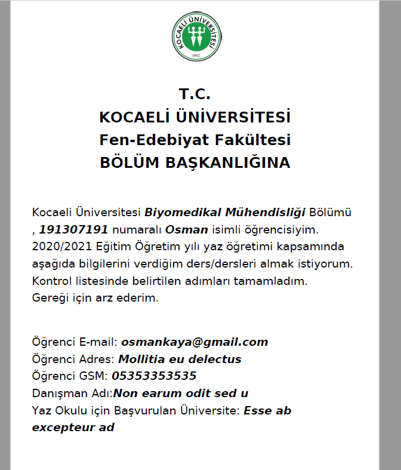
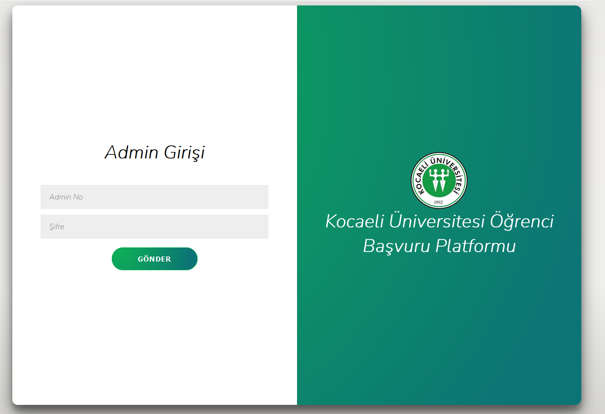

# About Project
I created a website using Laravel PHP and Firebase. It's a project for students to apply Kocaeli University. At first you have to sign up, then you can apply five different applications such as ; summer school application,  transfer applications. It has student and admin sides. In admin side, you can view applications and you can approve or reject them. In student side, users information for application converting into PDF and allows user to download. Then you have to upload files including downloaded PDF and other necessary documents.
  
### Login/Sign Up                                

  

For Sign Up process, data store in Firebase Realtime Database.
   
### Student Profile Page

You can navigate by using navigation bar or buttons to apply applications or view applied applications.

   

### Make an Application

|||
| ------------- | ------------- |
| Form for Application | PDF |

Fill the form and click bottom left button "PDF'e dönüştür (Convert to PDF)" to download PDF. Then continue with bottom-right button to upload necessary files.

   

### File Upload

#### Upload all files to complete application

   

### Admin Side

Admin Login

   

### Admin Panel Page

Admin panel page. You can see the application headers. In each header, there are buttons for Recieved Applications, Approved Applications and Rejected Applications

   

### Admin Recieved Applications

Applications from students

   

### Admin View Recieved Application and Reject or Approve

|| |
| ------------- | ------------- |
| View Application | Reject or Approve Box |

For last step, you can approve or reject student application.

